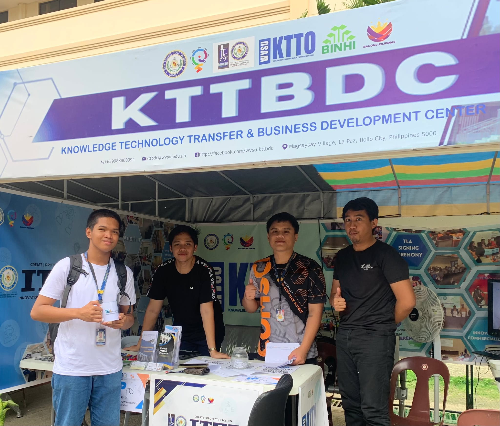

  

# 🌐 WVSU Knowledge Technology Transfer and Business Development Center Website 🚀  

## 📖 About the Project  
The **WVSU Knowledge Technology Transfer and Business Development Center (KTTBDC) Website** is a collaborative project developed during my internship before graduation, together with my fellow interns. Our goal was to design and build a **modern, responsive, and user-friendly one-page website** for the department.  

This project gave me the opportunity to apply my skills in **web design** and contribute to the **User Interface (UI)**, ensuring that the website was visually appealing, intuitive, and easy to navigate.  

---

## 🎨 My Contribution: User Interface (UI) Design  
My primary responsibility was focused on the **UI development** of the website.  
- Crafted a **clean and minimal one-page design** that highlights the department’s identity.  
- Ensured **responsiveness** across desktop, tablet, and mobile devices 📱💻.  
- Designed with **user-friendliness in mind**, making sure visitors can quickly access information.  
- Used **modern layouts and sections** with consistent typography, spacing, and colors.  

---

## 🖌️ Website Design  
The website follows a **OnePager structure** — simple, elegant, and effective:  

- **Header / Navigation Bar** 🧭  
  - Sticky top navigation for quick access to sections.  
- **About Section** 📑  
  - Overview of the department’s purpose and mission.  
- **Services / Programs Section** 💼  
  - Highlights the key services, activities, and initiatives.  
- **Projects / Activities Section** 📊  
  - Showcases ongoing and past initiatives of the department.  
- **Contact Section** 📩  
  - Easy-to-use contact form and department information.  

The design emphasizes **clarity, accessibility, and professional branding** while keeping everything on **one single page** for smooth navigation.  

---

## 👥 Collaboration  
This project was a **team effort**, created together with my fellow interns. Each of us contributed to different areas — from front-end design and coding to content preparation and deployment. My focus on **UI/UX design** complemented the team’s overall workflow, ensuring the final product looked polished and user-friendly.  

---

## 📈 Key Learnings  
- Improved my **UI/UX design skills** and gained hands-on experience working on a real-world department website.  
- Learned the importance of **collaboration and task delegation** in a professional setting.  
- Applied responsive design principles and best practices in web development.  

---

## 🙏 Acknowledgment  
This project would not have been possible without the support of the **WVSU Knowledge Technology Transfer and Business Development Center** and the guidance we received during our internship. It was a valuable experience that helped me grow as a developer and designer.  

---

## 🌺 Special Thanks  
I want to give **flowers and appreciation** 🌸🌼🌷 to my **fellow interns** who worked alongside me on this project. 💐 Together, we built not just a website, but also lasting memories and valuable learning experiences. 🤝✨  
