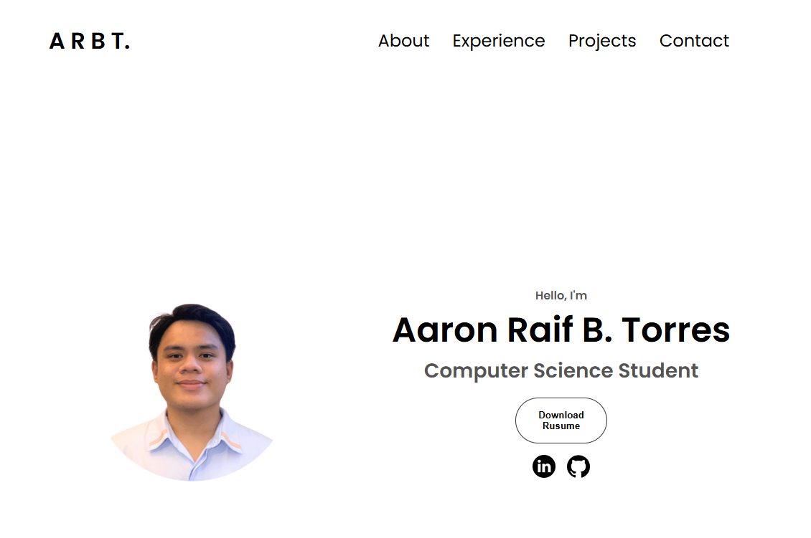

  

# 🎯 Portfolio Website – OnePager 🚀  

## 📖 About the Project  
The **Portfolio Website OnePager** is a personal project I created to showcase my background, experiences, and projects in a clean and professional way.  
It follows a **minimal design approach** while highlighting the most important details for potential employers or collaborators.  

Originally, this served as my **resume and portfolio site** while I was applying for internships, which is why the content still reflects me as a **student**. I have since graduated in **June 2025 🎓**, and this website continues to represent my journey, now as a **fresh graduate developer**.  

---

## 🎨 Design & Features  
The website is structured into **four main sections** for clarity and simplicity:  

- **About Section** 👤  
  A quick introduction of who I am and my career aspirations.  

- **Experience Section** 💼  
  Highlights of my academic experiences and relevant skills.  

- **Projects Section** 📂  
  A showcase of selected works I completed during college and personal practice projects.  

- **Contact Section** 📩  
  Links to my **LinkedIn**, **GitHub**, and a downloadable copy of my **Resume** for easy access.  

✨ The design is **minimal, responsive, and professional** — ensuring recruiters and visitors can quickly find the information they need without distraction.  

---

## ▶️ Live Preview  
Check out the deployed portfolio here:  
👉 [Portfolio Website](https://resume-qxd7.vercel.app/)  

---

## 🙏 Acknowledgment  
This project represents my growth as a developer — from using it as a **student portfolio for internships** to updating it now as a **fresh graduate ready for new opportunities**. 🌟  

