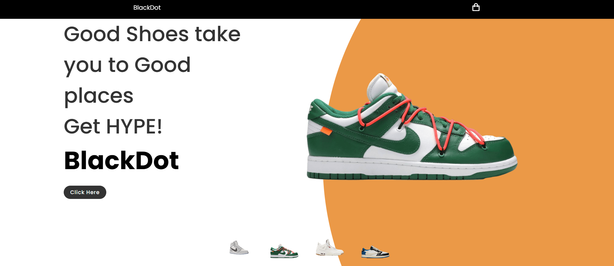

  

# 🛒 BlockDot E-Commerce Website 👟👕🎮  

## 📖 About the Project  
The **BlockDot E-Commerce Website** is a project I developed during my college years as part of our web development coursework. We were tasked to create a website using only **HTML, CSS, and JavaScript**, and I decided to build an **e-commerce platform** that focuses on selling **hypebeast shoes, clothes, and collectible items**.  

This project challenged me to apply my skills in **front-end development** while also exploring how to structure a simple yet functional online store. It was one of my first experiences creating a real-world inspired project and helped me understand the fundamentals of designing and coding an e-commerce website.  

---

## 🎨 Design & Features  
The website follows a **modern, minimal design** to keep the focus on products.  

- **Homepage / Landing Page** 🏠  
  - Clean product showcase with eye-catching visuals.  

- **Product Catalog** 🛍️  
  - Displays a collection of hypebeast shoes, apparel, and collectibles.  

- **Cart System (Front-End)** 🛒  
  - Users can add/remove items from their cart using **JavaScript DOM manipulation**.  

- **Responsive Layout** 📱💻  
  - Optimized for both desktop and mobile viewing.  

---

## 👨‍💻 My Role  
- Designed the **UI** with emphasis on showcasing trendy streetwear and collectibles.  
- Coded the website using **pure HTML, CSS, and JavaScript** (no frameworks).  
- Implemented interactive features such as adding/removing items from the cart.  

---

## 📈 Key Learnings  
- Strengthened my knowledge in **vanilla JavaScript** and **DOM manipulation**.  
- Learned how to structure an e-commerce layout with multiple sections.  
- Gained experience in combining **aesthetic design with basic functionality**.  

---

## ▶️ Demo / Preview  
*(Insert link or screenshots here if available)*  

---

## 🙏 Acknowledgment  
The **BlockDot E-Commerce Website** was a valuable project during my college journey 🎓. It not only tested my coding skills but also inspired me to keep exploring creative ways to design and develop websites. 🚀  

